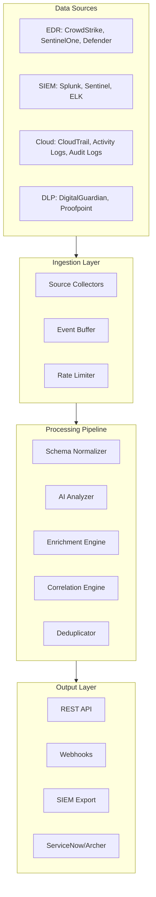

# High-Level Design: Threat Telemetry Hub

| Property | Value |
| --- | --- |
| Version | 1.0 |
| Author | Liem Vo-Nguyen |
| Date | January 2026 |
| Status | Active |
| LinkedIn | [linkedin.com/in/liemvonguyen](https://linkedin.com/in/liemvonguyen) |

---

## 1. Executive Summary

Threat Telemetry Hub is an AI-powered security telemetry aggregation and enrichment platform that unifies security data from multiple sources (EDR, SIEM, Cloud, DLP) to provide:

- **Unified Visibility**: Single pane of glass across all security telemetry
- **AI-Powered Analysis**: Claude Opus 4.5 contextual risk scoring on raw data
- **Schema Normalization**: OCSF and ECS standardization
- **Threat Enrichment**: Integration with threat intelligence feeds
- **Automated Ticketing**: ServiceNow and Archer GRC integration
- **Cross-Source Correlation**: Attack chain detection across sources

### 1.1 Business Drivers

- Reduce alert fatigue through intelligent deduplication and correlation
- Accelerate incident response with AI-generated context and recommendations
- Normalize disparate security tools into unified schema
- Enable proactive threat hunting with enriched data
- Automate ticket creation for actionable findings

---

## 2. Architecture Overview



### 2.1 Component Summary

| Component | Purpose | Technology |
| --- | --- | --- |
| Ingestion Manager | Orchestrates data collection from sources | Go |
| EDR Collectors | CrowdStrike, SentinelOne, Defender APIs | Go |
| SIEM Collectors | Splunk HEC, Elasticsearch, Sentinel | Go |
| Cloud Collectors | AWS/Azure/GCP audit log ingestion | Go |
| DLP Collectors | DigitalGuardian, Proofpoint integration | Go |
| Schema Normalizer | OCSF/ECS transformation | Go |
| AI Analyzer | Contextual risk scoring | Claude Opus 4.5 / GPT-4 |
| Enrichment Engine | Threat intel, identity, asset context | Go |
| Correlation Engine | Cross-source event correlation | Go |
| Deduplicator | Finding deduplication logic | Go |
| Ticketing Manager | ServiceNow/Archer integration | Go |

---

## 3. Data Flow

### 3.1 Ingestion Pipeline

```
Raw Event → Collector → Buffer → Rate Limiter → Processing Queue
```

### 3.2 Processing Pipeline

```
Raw Event → AI Pre-Analysis → Normalization → Enrichment → Correlation → Deduplication → Output
```

### 3.3 AI Analysis Points

1. **Pre-Normalization**: Analyze raw events for hidden patterns before schema mapping
2. **Post-Normalization**: Contextual risk scoring with environment awareness
3. **Correlation**: Attack chain and toxic combination detection
4. **Output**: Natural language summaries for tickets

---

## 4. AI Capabilities

### 4.1 Contextual Risk Scoring

| Factor | Weight | Description |
| --- | --- | --- |
| Environment | High | Production vs non-production |
| Data Sensitivity | High | PII, PHI, financial data exposure |
| Network Exposure | Medium | Internet-facing vs internal |
| Exploit Availability | High | Known exploits in the wild |
| Attack Chain Position | High | Part of larger attack sequence |

### 4.2 Analysis Types

| Type | Description |
| --- | --- |
| Anomaly Detection | Behavioral baselines and deviation alerts |
| Attack Chain Correlation | Related events across sources |
| Toxic Combo Detection | High-risk finding combinations |
| Natural Language Summaries | Human-readable threat descriptions |
| Remediation Recommendations | Prioritized action items |

---

## 5. Ticketing Integration

### 5.1 ServiceNow

| Feature | Implementation |
| --- | --- |
| Incident Creation | REST API with CMDB enrichment |
| SecOps Integration | sn_si_incident table support |
| Work Notes | Automated updates on correlation |
| Assignment Rules | Configurable routing logic |

### 5.2 Archer GRC

| Feature | Implementation |
| --- | --- |
| Record Creation | HMAC-authenticated REST API |
| Risk Documentation | Field mapping to Archer apps |
| Workflow Integration | Status synchronization |

### 5.3 Auto-Ticketing Rules

```yaml
ticketing:
  auto_create: true
  min_risk_score: 7.0
  priority_mapping:
    critical: 1
    high: 2
    medium: 3
    low: 4
  assignment_rules:
    - condition: "category == 'malware'"
      assignment_group: "SOC Tier 2"
    - condition: "category == 'data_exfiltration'"
      assignment_group: "DLP Team"
```

---

## 6. Schema Normalization

### 6.1 Supported Schemas

| Schema | Use Case |
| --- | --- |
| OCSF | Vendor-neutral security events |
| ECS | Elasticsearch/ELK compatibility |

### 6.2 Field Mapping

Core fields mapped across all sources:
- Timestamp, Event Type, Severity
- Source/Destination (IP, Host, User)
- Process information
- File information
- Network information
- MITRE ATT&CK mapping

---

## 7. Enrichment Sources

| Source | Data Provided |
| --- | --- |
| ThreatForge | Threat intelligence, IOC context |
| Entra ID/Okta | User identity, group membership, risk |
| CMDB | Asset context, owner, criticality |
| Geolocation | IP geolocation, reputation |
| VirusTotal | File/URL reputation |

---

## 8. Deployment

### 8.1 Container Architecture

```yaml
services:
  hub:
    image: threat-telemetry-hub:latest
    replicas: 3
    resources:
      cpu: 2
      memory: 4Gi
  
  redis:
    image: redis:7-alpine
    
  postgres:
    image: postgres:16-alpine
```

### 8.2 Scaling

| Component | Strategy |
| --- | --- |
| Collectors | Horizontal scaling per source |
| Processing | Worker pool with queue |
| API | Load-balanced replicas |

---

## 9. API Reference

### 9.1 Core Endpoints

| Endpoint | Method | Description |
| --- | --- | --- |
| /api/v1/events | GET/POST | List/ingest events |
| /api/v1/events/{id}/analyze | POST | Trigger AI analysis |
| /api/v1/correlations | GET | Get correlated event chains |
| /api/v1/tickets | POST | Create ticket for finding |
| /api/v1/health | GET | Health check |

---

## 10. Configuration

```yaml
server:
  port: 8080
  
ai:
  provider: anthropic  # or openai
  model: claude-opus-4-5-20250514
  api_key_env: ANTHROPIC_API_KEY
  
ingestion:
  edr:
    crowdstrike:
      enabled: true
      poll_interval: 60s
    sentinelone:
      enabled: true
      poll_interval: 60s
      
  siem:
    splunk:
      enabled: true
      hec_url: https://splunk:8088
      
ticketing:
  default_provider: servicenow
  servicenow:
    instance_url: https://company.service-now.com
    username_env: SNOW_USER
    password_env: SNOW_PASS
```

---

## Appendix A: Technology Stack

| Category | Technology |
| --- | --- |
| Language | Go 1.22 |
| AI | Anthropic Claude Opus 4.5, OpenAI GPT-4 |
| Database | PostgreSQL 16 |
| Cache | Redis |
| Container | Kubernetes |
| Observability | Prometheus, Grafana, OpenTelemetry |

